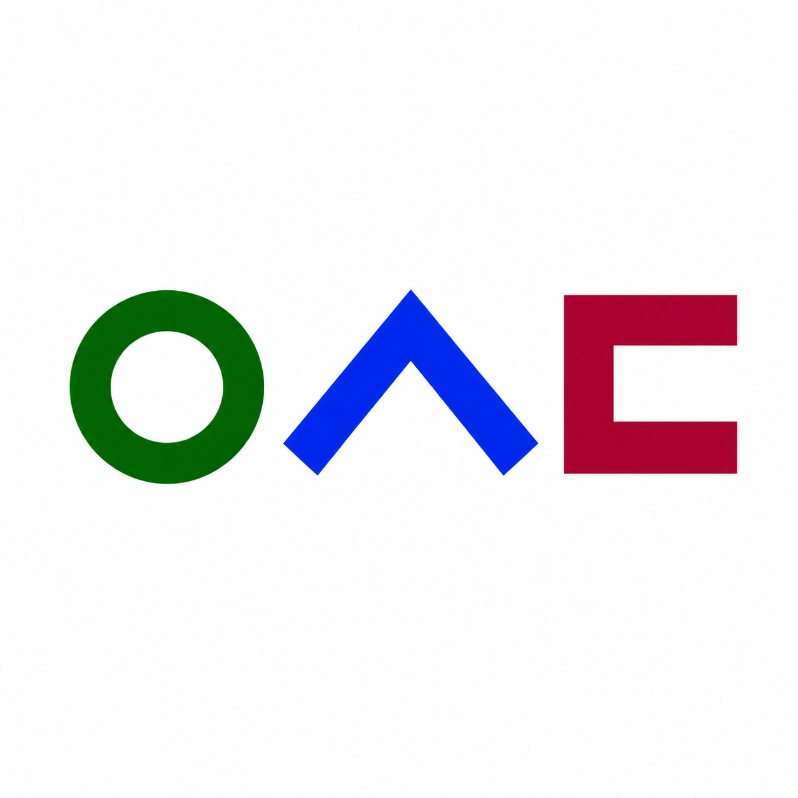
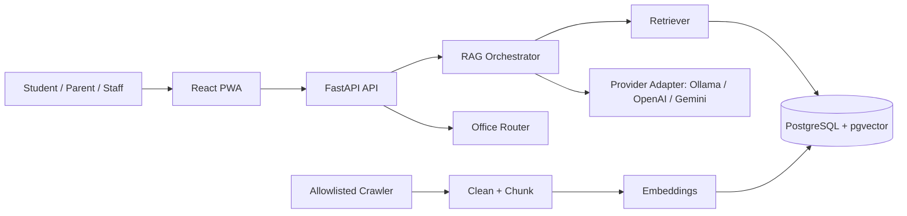

<div align="center">



# InsaBot for Woosong

### Verified, multilingual AI assistant for Woosong University

Answers students, parents, and staff in **14 languages** — grounded only in official university sources, never hallucinated.

<!-- CI/CD status badges — replace OWNER/REPO after pushing to GitHub -->
[](LICENSE)
[](CONTRIBUTING.md)

<br/>


</div>

---

## Why InsaBot?

International students at Woosong navigate visas, tuition, scholarships, and housing across a language barrier — and generic chatbots happily invent deadlines and policies. **InsaBot refuses to guess.** Every answer is retrieved from official, allowlisted university pages and cited. When the sources don't cover a question, InsaBot says so and routes the user to the correct office instead of fabricating an answer.

- **Source-grounded RAG** — retrieval over official content happens *before* generation; answers carry citations.
- **Truly multilingual** — answers are generated directly in the user's language (auto-detected), across 14 languages.
- **Safe by design** — prompt-injection and sensitive-topic guards, a mandatory "unverified" fallback, and rate limiting.
- **Admin review workflow** — crawled content is held for approval; admins manage sources, FAQs, and analytics.
- **Installable PWA** — works on mobile and desktop, offline-aware.

## Tech stack

| Layer | Stack |
|-------|-------|
| **Frontend** | React 18 · TypeScript · Vite · Tailwind CSS · React Router · TanStack Query · Zustand · react-i18next · PWA |
| **Backend** | Python 3.11 · FastAPI · SQLModel · Pydantic · SlowAPI · Alembic · APScheduler |
| **Data** | PostgreSQL + pgvector (SQLite for local/tests) |
| **AI** | Ollama (default, local) · OpenAI-compatible · Gemini — chat `llama3.2:3b`, embeddings `bge-m3` |

## Architecture



More detail in [`docs/architecture.md`](docs/architecture.md).

## Quick Start

> **Prerequisites:** Node.js 20+, Python 3.11+, and (optional but recommended) [Ollama](https://ollama.com) for local models. Docker is optional for the full stack.

### 1. Clone & configure

```bash
git clone https://github.com/OWNER/REPO.git
cd insabot-for-woosong
cp .env.example .env
```

### 2. Install dependencies

```bash
# Frontend (npm workspace)
npm install

# Backend (virtual environment recommended)
python -m venv backend/.venv
backend/.venv/Scripts/activate        # Windows
# source backend/.venv/bin/activate   # macOS / Linux
pip install -r backend/requirements.txt -r backend/requirements-dev.txt
```

### 3. (Optional) Pull local models

```bash
ollama pull llama3.2:3b
ollama pull bge-m3
```

### 4. Run

```bash
# Terminal 1 — backend API (http://localhost:8000, interactive docs at /docs)
uvicorn app.main:app --reload --app-dir backend

# Terminal 2 — frontend (http://localhost:5173)
npm run dev
```

Or run everything with Docker:

```bash
docker compose up --build
```

## Common commands

| Command | What it does |
|---------|--------------|
| `npm run dev` | Start the frontend dev server |
| `npm run build` | Production build (typecheck + Vite) |
| `npm run test:frontend` | Run Vitest |
| `npm run test:backend` | Run Pytest |
| `npm run lint` | ESLint (frontend) |
| `npm run format` | Prettier write |
| `npm run crawl` | Run the allowlisted crawler |
| `npm run evaluate` | Evaluate RAG quality (release gate) |

Backend formatting/linting (from `backend/`): `ruff check .` and `black .`.
Full operational procedures (DB verification, admin bootstrap, evaluation modes, crawling) live in [`docs/operations.md`](docs/operations.md).

## Documentation

| Doc | Description |
|-----|-------------|
| [Architecture](docs/architecture.md) | System diagram and data flow |
| [API](docs/api.md) | HTTP endpoint reference |
| [Deployment](docs/deployment.md) | Docker and hosted options |
| [Operations](docs/operations.md) | DB verification, evaluation, crawler, admin bootstrap |
| [Ingestion guide](docs/ingestion-guide.md) | Crawling, cleaning, embedding |
| [Security](docs/security.md) | Threat model and safeguards |
| [Contributing](CONTRIBUTING.md) · [Code of Conduct](CODE_OF_CONDUCT.md) · [Security Policy](SECURITY.md) | Project governance |

## Contributing

Contributions are welcome! Please read [CONTRIBUTING.md](CONTRIBUTING.md) for the development workflow, coding standards, and PR process, and our [Code of Conduct](CODE_OF_CONDUCT.md). Found a vulnerability? See [SECURITY.md](SECURITY.md).

## License

Released under the [MIT License](LICENSE).

<div align="center">
<sub>Not officially affiliated with or endorsed by Woosong University. The Woosong name and logo are property of their respective owner. For commercial use, obtain official permission from Woosong University before broad crawling or deployment.</sub>
</div>
